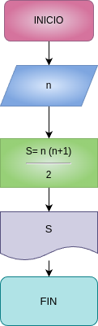

# Suma_n_Numeros
Ejercicio N-2 suma de los n primeros números naturales 

# Analisis 

## Input 

## Variables de entrada
n: número al que se desea aplicar la formula 
### processing
s: suma de los primeros n números 

s= (n*(n+1))/2

### outpout
s
# Diseño

# construccion